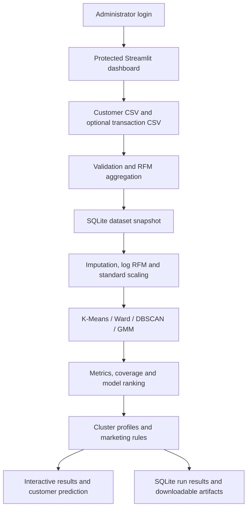
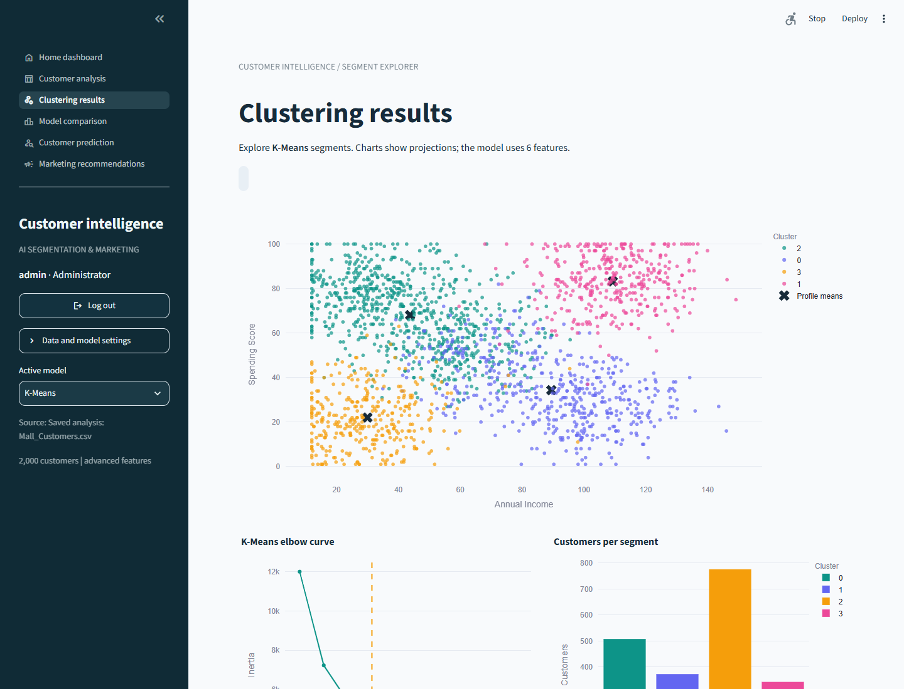
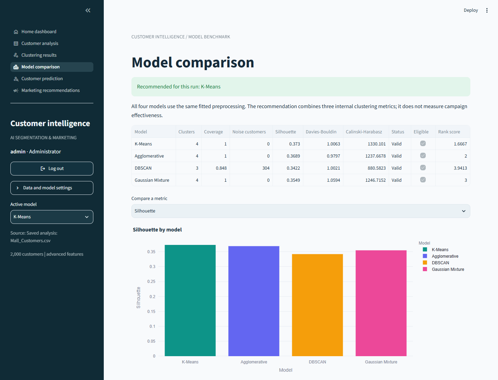
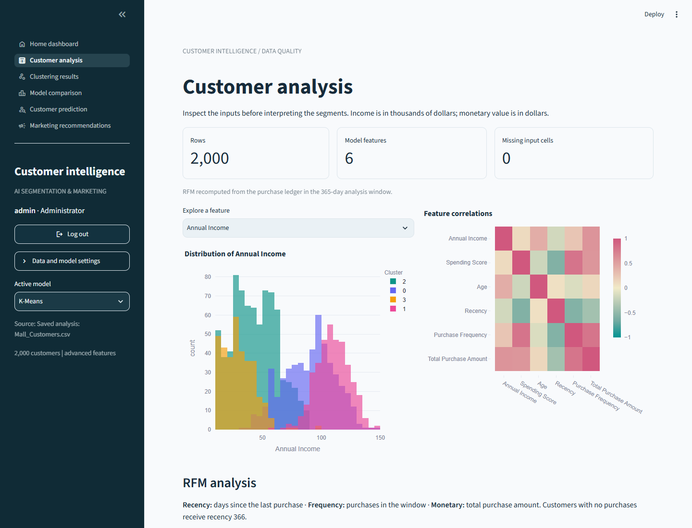

# AI-Based Customer Segmentation and Personalized Marketing Recommendation System using Machine Learning

**A college ML project with authenticated analytics, transaction-derived RFM, four clustering models and explainable marketing suggestions.**


| Demonstration | Included result |
|---|---|
| Customers / transactions | 2,000 / 32,800 synthetic records |
| Recommended model | K-Means, four clusters |
| Silhouette score | 0.3730; internal separation measure, not accuracy |
| Interface | Administrator login and six protected dashboard views |
| Submission material | 44-page report, editable 15-slide presentation, 50 viva answers |

[Project report](documentation/Project_Report.pdf) · [Presentation](documentation/Presentation.pptx) · [Final viva guide](VIVA_GUIDE_FINAL.md) · [Editing instructions](documentation/EDITING_GUIDE.md) · [Verification](documentation/VERIFICATION.md)

## Abstract

This project groups customers by purchase behavior and demographic measurements, compares alternative clustering methods and converts segment profiles into transparent marketing suggestions. Recency, frequency and monetary value are derived from transaction records and combined with annual income, spending score and age. Four clustering algorithms are evaluated in a common transformed feature space. A Streamlit dashboard provides administrator authentication, CSV upload, interactive visualizations, model comparison, customer assignment and explanations. SQLite preserves dataset snapshots and analysis history. Synthetic data makes the demonstration reproducible; the results do not establish real-world marketing effectiveness.

## Introduction

Customers with similar incomes can have different buying habits. Purchase history adds context: a frequent shopper, a premium customer and a previously active customer who has stopped purchasing may require different actions.

This upgrades **Mall Customer Segmentation using K-Means Clustering**. The original working project remains in `legacy/`, and the advanced application retains a classic income/spending mode. Here, AI means unsupervised machine learning plus explicit recommendation rules. No LLM, paid API or campaign delivery service is required.

## Problem Statement

How can an analyst transform customer and purchase records into interpretable groups, compare clustering approaches, explain a new customer's assignment and inspect suitable marketing actions in one reproducible system?

## Objectives

- Preserve preprocessing, EDA, K-Means, elbow analysis, silhouette evaluation, model saving and visualization.
- Derive auditable RFM features and compare four clustering algorithms.
- Explain assignments and show segment profiles with actionable suggestions.
- Provide an authenticated dashboard with uploads, 2D/3D graphs and downloads.
- Store customers, transactions, clustering results and recommendations in SQLite.
- Deliver runnable source, synthetic data, measured outputs and college presentation material.

## System Architecture



The command-line workflow shares the same analytics modules. Saved bundles include fitted preprocessing and recommendation thresholds, so prediction reuses training transformations.

## Technologies Used

| Technology | Role |
|---|---|
| Python | Application and analytics |
| pandas / NumPy | Tabular and numerical processing |
| scikit-learn | Preprocessing, clustering and evaluation |
| Matplotlib / seaborn | Saved plots and EDA |
| Plotly | Interactive 2D/3D charts |
| Streamlit | Login, navigation, forms and dashboard |
| SQLite / Python standard library | Dataset history, password hashing and sessions |
| ReportLab / pypdf / PyMuPDF | Optional PDF generation and verification |
| Microsoft PowerPoint | Editable presentation generation and rendering |

PowerPoint and document-generation packages are **not required to run the ML application**. Completed PDF/PPTX files are included.

## Dataset Description

The supplied files contain **2,000 synthetic customers and 32,800 synthetic transactions**, generated with seed 42. Reference date: **2026-09-25**. See [provenance](dataset/provenance.json).

| Customer column | Meaning / units | Advanced model input |
|---|---|---|
| CustomerID | Unique join identifier | No |
| Gender | Descriptive category | No |
| Age | Years | Yes |
| Annual Income | Thousands of USD | Yes |
| Spending Score | Indicator from 1 to 100 | Yes |
| Purchase Frequency | Purchases in the window | Yes |
| Total Purchase Amount | USD spent in the window | Yes |
| Last Purchase Date | Latest in-window purchase | Used for validation/RFM |
| Recency | Days since latest in-window purchase | Yes |
| Customer Satisfaction Score | Synthetic rating from 1 to 5 | No |

`Transactions.csv` contains `TransactionID`, `CustomerID`, `Purchase Date` and `Amount`. Each row represents one completed purchase with a positive amount. Refunds and multi-line orders require a richer input contract.

The original `Annual Income (k$)` and `Spending Score (1-100)` names remain accepted aliases. Classic mode accepts the original five-column schema. Advanced mode needs RFM summaries or a transaction ledger. Interactive uploads support 20–10,000 customers.

## RFM Analysis Explanation

- **Recency:** days between the reference date and latest qualifying purchase.
- **Frequency:** number of qualifying purchase rows per customer.
- **Monetary:** sum of qualifying purchase amounts per customer.

Purchases are filtered from `reference date - 365 days` through the reference date, **both boundaries included**. Future purchases are rejected. Customers without purchases in that window retain frequency/value zero and recency 366, a documented sentinel. A supplied ledger is authoritative and replaces supplied RFM summaries.

Example: purchases of $120, $80 and $100, latest on 20 September with reference date 25 September, yield **R = 5 days, F = 3, M = $300**.

Preprocessing applies fitted median imputation, `log1p` to RFM and standard scaling. IDs, gender and satisfaction do not enter distances. The [technical guide](documentation/Technical_Guide.md) explains validation and model interfaces.

## Machine Learning Algorithms

| Algorithm | Grouping method | New-customer assignment |
|---|---|---|
| K-Means | Nearest-center assignment and mean updates | Native prediction |
| Agglomerative / Ward | Merges groups to limit variance increases | Explicit nearest-centroid proxy |
| DBSCAN | Density-connected groups and noise (-1) | Project extension: fitted core sample within `eps` |
| Gaussian Mixture | Weighted Gaussian components | Native maximum-posterior component |

K-Means is efficient, beginner-friendly and has interpretable centers. Scaling and compact-cluster assumptions matter. The elbow heuristic suggests a count; it does not prove a universally optimal segmentation. K-Means, Ward and GMM share the selected count; DBSCAN determines its own.

### Literature Survey

The [scikit-learn clustering guide](https://scikit-learn.org/stable/modules/clustering.html) describes centroid, hierarchical and density-based assumptions. The [mixture guide](https://scikit-learn.org/stable/modules/mixture.html) describes probabilistic components. [Fader, Hardie and Lee (2005)](https://www.brucehardie.com/papers/018/) provide a separate probabilistic customer-base analysis direction; this project computes descriptive RFM and does not implement their BG/NBD model. Internal validation supports comparison without known labels; business usefulness needs external validation.

## Model Comparison

Measured advanced-mode configuration: seed 42, k = 4, DBSCAN `eps = 0.75`, `min_samples = 10`.

| Model | Clusters | Coverage | Silhouette (higher) | Davies-Bouldin (lower) | Calinski-Harabasz (higher) |
|---|---:|---:|---:|---:|---:|
| K-Means | 4 | 100% | 0.3730 | 1.0063 | 1330.10 |
| Agglomerative | 4 | 100% | 0.3689 | 0.9797 | 1237.67 |
| DBSCAN | 3 | 84.8% | 0.3422 | 1.0021 | 880.58 |
| Gaussian Mixture | 4 | 100% | 0.3549 | 1.0594 | 1246.72 |

**K-Means is recommended by the implemented ranking policy.** Eligible models need valid metrics and at least 80% coverage. Metric ranks are averaged and combined with an unassigned-customer penalty. DBSCAN scores exclude noise and describe its assigned subset. Ward leads Davies-Bouldin; K-Means leads the other two metrics. Parameters were explored on the demonstration data; these are not held-out benchmark results.


## Results

| K-Means group | Customers | Category | Suggested action |
|---|---:|---|---|
| 0 | 508 | Growth opportunity | Discounts and personalized product campaigns |
| 1 | 373 | VIP segment | Premium membership, luxury offers and early access |
| 2 | 776 | Value-focused loyalists | Budget-friendly offers, bundles and loyalty rewards |
| 3 | 343 | At-risk / Engagement segment | Engagement and win-back suggestions |

DBSCAN marks 304 customers as noise. Cluster IDs are arbitrary and may change after retraining. Recommendations use group means, frozen cohort median thresholds and explicit rules such as average recency over 90 days. They are segment suggestions, not learned campaign-response predictions.

Prediction accepts age, gender, income, spending score, recency, frequency and monetary value. It returns a group, category, recommendation and explanation. K-Means explanations compare transformed feature distances; Ward explains its centroid proxy; DBSCAN explains core-sample proximity; GMM shows posterior assignment with descriptive mean similarity. These are not causal explanations.

Included outputs: [customer assignments](outputs/segmented_customers.csv), [cluster profiles](outputs/cluster_centers.csv), [comparison metrics](outputs/model_comparison.csv), [sample prediction](outputs/sample_prediction.json), PNG graphs and an [interactive 3D chart](outputs/customer_3d.html).

## Dashboard Screenshots

These are actual screenshots from the running application, saved in `documentation/screenshots/` and mirrored in `screenshots/`.

| Login | Home dashboard |
|---|---|
|  |  |

| Segmentation | 3D visualization |
|---|---|
|  |  |

| Model comparison | Customer prediction |
|---|---|
|  |  |

| Marketing recommendations | Customer analysis |
|---|---|
|  |  |

## Installation Steps

Use Python 3.11 or newer. The verified local environment uses Python 3.14.6. Open the folder in VS Code and select `.venv\Scripts\python.exe` through **Python: Select Interpreter**.

For a fresh copy, use the VS Code PowerShell terminal:

```powershell
cd "D:\ML project\AI_Customer_Segmentation"
python -m venv .venv
.\.venv\Scripts\python.exe -m pip install -r requirements.txt
.\.venv\Scripts\python.exe main.py
.\.venv\Scripts\python.exe -m streamlit run app.py --server.address 127.0.0.1
```

Replace the first path if extracted elsewhere. `requirements-lock.txt` records verified runtime versions for compatible environments. macOS/Linux users can substitute `python3 -m venv .venv` and `.venv/bin/python`.

## How to Run

The existing local environment is already installed. Start with:

```powershell
cd "D:\ML project\AI_Customer_Segmentation"
.\.venv\Scripts\python.exe -m streamlit run app.py --server.address 127.0.0.1
```

Open **http://localhost:8501**. Login: **`admin` / `admin123`**. Keep the terminal open; press **Ctrl+C** to stop. Virtual-environment activation is unnecessary with these commands.

### Authentication and Navigation

The login gate runs before dashboard data and pages. The sidebar displays administrator information and logout. Passwords use salted PBKDF2-HMAC-SHA256 (600,000 iterations); SQLite stores hashed session tokens. Five failures trigger a one-minute account lock. Sessions expire after 30 minutes idle or eight hours total, checked on interaction. Logout revokes the token and clears session state. Reloading the browser may require login again.

This is a **local college demonstration**, with a published shared password. Bootstrap credentials can be set with `AI_ADMIN_USERNAME` and `AI_ADMIN_PASSWORD` **before the first creation of `database/auth.db`**; these variables do not reset an existing account. Local databases and uploaded records are excluded from Git and the portable ZIP.

1. **Home dashboard:** total customers, transactions, best model, cluster count, silhouette and segment cards.
2. **Customer analysis:** preview, missing values, distributions, correlations and RFM.
3. **Clustering results:** 2D/3D views, elbow chart, distribution and assignments.
4. **Model comparison:** metrics, charts, coverage and recommendation policy.
5. **Customer prediction:** seven inputs, assignment and explanation.
6. **Marketing recommendations:** profile cards and audience downloads.

Open **Data and model settings** in the sidebar, upload customer/transaction CSVs and click **Run analysis**. Select a fitted algorithm without retraining. Uploaded analyses stay in the session and local SQLite; bundled CSV/model artifacts remain the demonstration baseline.

### Command-line Examples

```powershell
.\.venv\Scripts\python.exe main.py --help
.\.venv\Scripts\python.exe main.py --clusters 5
.\.venv\Scripts\python.exe main.py --data dataset/My_Customers.csv --transactions dataset/My_Transactions.csv --as-of 2026-09-25
.\.venv\Scripts\python.exe main.py --mode classic --data legacy/dataset/Mall_Customers.csv
```

CLI training replaces current model/output artifacts and appends a SQLite run. Use separate `--output`, `--model-dir` and `--database` paths for experiments. `--generate` explicitly replaces synthetic CSVs. Original `legacy/main.py` and `legacy/app.py` remain available; the legacy app is a separate historical demo without the new login.

### Verification and Artifact Regeneration

```powershell
.\.venv\Scripts\python.exe -m unittest -v test_project.py
# Optional browser/document tools:
.\.venv\Scripts\python.exe -m pip install -r requirements-docs.txt
.\.venv\Scripts\python.exe scripts/capture_screenshots.py
.\.venv\Scripts\python.exe scripts/build_report.py
powershell -NoProfile -ExecutionPolicy Bypass -File scripts/build_presentation.ps1
.\.venv\Scripts\python.exe scripts/verify_artifacts.py
```

Screenshot capture requires Microsoft Edge. Presentation regeneration requires Microsoft PowerPoint on Windows. See [editing instructions](documentation/EDITING_GUIDE.md); neither tool is needed for everyday dashboard use.

## Project Structure

```text
AI_Customer_Segmentation/
|-- dataset/                   # Customer/transaction CSVs and provenance
|-- models/                    # Fitted model and preprocessing bundles
|-- database/                  # Local customers.db and auth.db, auto-created
|-- outputs/                   # Graphs, metrics, assignments and prediction
|-- screenshots/               # Eight dashboard captures
|-- documentation/
|   |-- Project_Report.pdf     # 44-page report
|   |-- Presentation.pptx      # 15 editable slides
|   |-- Viva_Guide.md          # 50 answers and two-minute explanation
|   |-- Project_Report_Source.md
|   |-- submission_details.json
|   |-- EDITING_GUIDE.md
|   |-- VERIFICATION.md
|   `-- screenshots/
|-- src/                       # Auth, preprocessing, clustering, prediction,
|                              # recommendations, database and workflow
|-- app_pages/                 # Six protected dashboard views
|-- scripts/                   # Screenshot, PDF, PPTX and ZIP generators
|-- legacy/                    # Original 500-customer project
|-- .streamlit/config.toml
|-- .vscode/settings.json
|-- app.py
|-- main.py
|-- test_project.py
|-- requirements.txt
|-- requirements-lock.txt
|-- requirements-dev.txt
|-- requirements-docs.txt
|-- AI_Customer_Segmentation_Project_Report.pdf
|-- AI_Customer_Segmentation_Presentation.pptx
|-- VIVA_GUIDE_FINAL.md
`-- README.md
```

SQLite history tables: `datasets`, `customers`, `transactions`, `runs`, `cluster_results` and `recommendations`. Authentication uses separate `auth.db`. Running `main.py` builds the analytics database from the included CSVs in a fresh copy. One-off prediction inputs are not inserted as customers.

## Future Scope

- Validate segments on representative customer data and review them with domain experts.
- Study stability across seeds, samples, windows and parameter settings.
- Evaluate feature weights and correlated RFM measurements.
- Add order/refund handling, product affinity and drift monitoring.
- Measure campaign outcomes through controlled experiments.
- Add managed identity, access roles, retention controls and production monitoring.

## Limitations

- Synthetic data cannot establish real-world segment quality or revenue gains.
- Internal metrics are not accuracy. DBSCAN scores describe its assigned subset.
- Scaling, correlation, feature choice and parameters influence results.
- Ward and DBSCAN prediction use documented extensions rather than native new-point prediction.
- Recommendations inherit group profiles; they are rule-based and do not rank individual products.
- The shared local account and SQLite design target college demonstration, not production deployment.
- Saved pickle files must be trusted and version-compatible; uploaded pickle artifacts are not accepted.

## College Submission

Editable details use the information supplied: **Nigilan**, **145731105**, **Sathyabama university**, **BE CSE AI**, **2026–2027**. The guide remains `[Guide name - not assigned]`. The certificate is an unsigned template for institutional review; no signature, approval or guide identity is fabricated.

Read the [two-minute explanation and 50 viva answers](VIVA_GUIDE_FINAL.md), then demonstrate login, model comparison, prediction and CSV upload.
