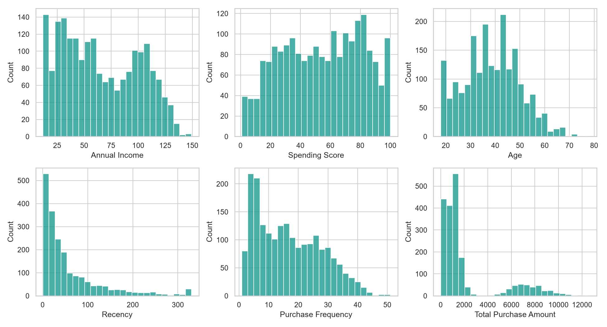
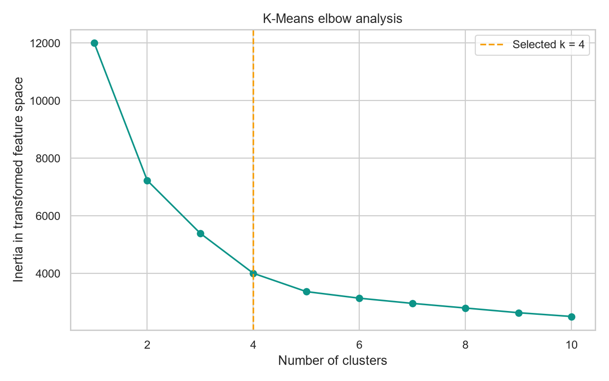
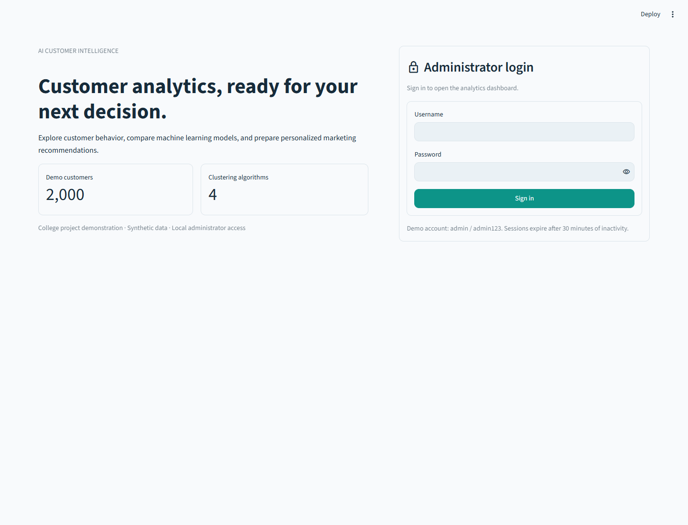
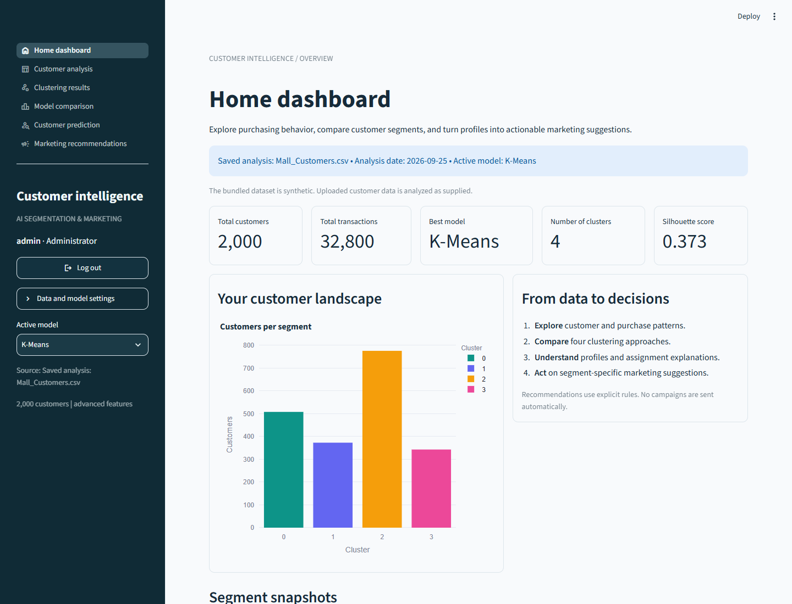
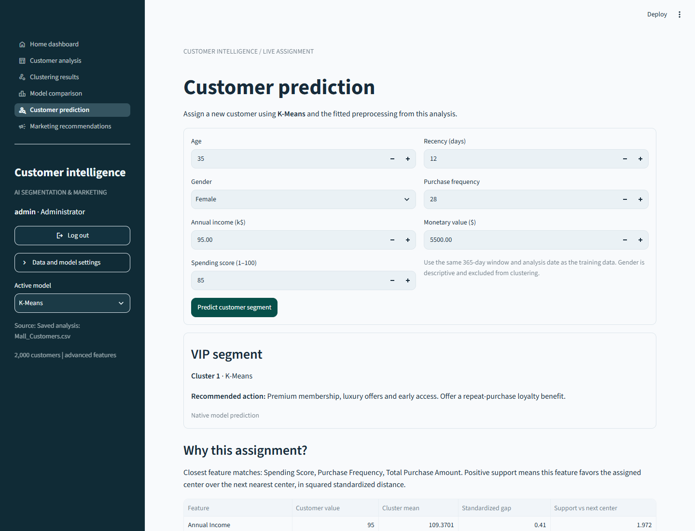
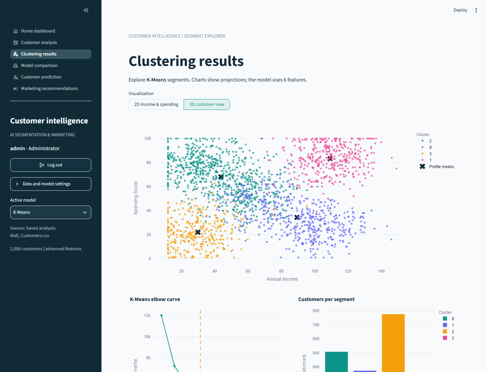

# Cover page
@cover

---PAGE---
# Certificate page
@certificate

---PAGE---
# Acknowledgement
@acknowledgement

---PAGE---
# Abstract
This project implements an AI-based customer segmentation and personalized marketing recommendation system using machine learning. Its purpose is to make customer analytics understandable and reproducible in a college demonstration. The system combines demographic measurements with recency, frequency and monetary value, compares several clustering approaches, and translates cluster profiles into clearly stated marketing suggestions.

The demonstration contains 2,000 synthetic customers and 32,800 synthetic purchases. A fixed analysis date of 25 September 2026 makes recency reproducible. The purchase ledger supplies counts, spending totals and latest purchase dates. Missing numeric values are handled with fitted median imputation; RFM features are log-transformed before standardization. Six features enter advanced clustering: annual income, spending score, age, recency, purchase frequency and total purchase amount.

Four algorithms are evaluated: K-Means, Ward agglomerative clustering, DBSCAN and Gaussian Mixtures. Silhouette, Davies-Bouldin and Calinski-Harabasz scores support an explicit ranking policy that also considers DBSCAN coverage. On the included configuration, K-Means is recommended with four clusters and silhouette 0.373. This is an internal geometric evaluation, not classification accuracy or evidence of successful marketing campaigns.

The implementation includes a local administrator login, six protected dashboard views, interactive 2D and 3D visualizations, saved models, SQLite history, customer prediction and assignment explanations. Marketing outputs use transparent rules applied to cluster means. The original income/spending project remains available for comparison. Eleven automated tests and browser checks verify important workflows. The report explains limitations arising from synthetic data, feature choices, clustering assumptions and the local demonstration authentication design.

**Keywords:** customer segmentation; unsupervised learning; RFM; K-Means; DBSCAN; Gaussian Mixture; Streamlit; SQLite; explainability.

---PAGE---
# Table of contents
| Section | Page |
| Cover page | 1 |
| Certificate page | 2 |
| Acknowledgement | 3 |
| Abstract | 4 |
| Table of contents | 5 |
| Figures, tables and abbreviations | 6 |
| Chapter 1 - Introduction | 7-8 |
| Chapter 2 - Literature Survey | 9-10 |
| Chapter 3 - Problem Statement and Objectives | 11-12 |
| Chapter 4 - Methodology | 13-16 |
| Chapter 5 - Dataset Description | 17-19 |
| Chapter 6 - Data Preprocessing | 20-21 |
| Chapter 7 - RFM Analysis | 22-23 |
| Chapter 8 - Machine Learning Algorithms | 24-28 |
| Chapter 9 - Model Evaluation | 29-31 |
| Chapter 10 - System Implementation | 32-38 |
| Chapter 11 - Results and Discussion | 39-41 |
| Chapter 12 - Conclusion | 42 |
| Chapter 13 - Future Scope | 43 |
| References | 44 |

Page numbers refer to the physical pages in this PDF. The editable source is Project_Report_Source.md. Personal and college details are supplied through submission_details.json and editable PDF form fields on the preliminary pages.

---PAGE---
# Figures, tables and abbreviations
| Figure | Page |
| System architecture | 13 |
| Machine learning workflow | 14 |
| Data flow diagram | 15 |
| Feature distributions | 19 |
| Clustering workflow | 24 |
| Elbow curve | 25 |
| Administrator login | 34 |
| Home dashboard | 35 |
| Customer prediction | 36 |
| Marketing recommendations | 37 |
| Model comparison chart | 39 |
| RFM 3D visualization | 41 |

Important tables include requirement traceability (12), customer schema (17), algorithm comparison (10), model ranking (30), database schema (33), tests (38), and segment profiles (40).

| Abbreviation | Meaning |
| AI / ML | Artificial intelligence / machine learning |
| RFM | Recency, frequency, monetary value |
| GMM | Gaussian Mixture Model |
| DBSCAN | Density-Based Spatial Clustering of Applications with Noise |
| DBI / CH | Davies-Bouldin / Calinski-Harabasz index |
| CSV / SQL | Comma-separated values / Structured Query Language |
| KPI | Key performance indicator |
| PBKDF2 | Password-Based Key Derivation Function 2 |

---PAGE---
# Chapter 1 - Introduction
## 1.1 Background and motivation
A customer database may contain many measurements without a clear picture of the people it describes. A mall analyst can inspect income or spending independently, but that approach can miss combinations of behavior. Customers with similar income may purchase at different frequencies, spend different amounts per visit, or have stopped shopping recently. Customer segmentation is a way to organize such variation into groups that can be examined and discussed.

The initial version of this project used annual income and spending score with K-Means. That version is a useful teaching example because two-dimensional scatter plots directly show the selected feature space. The upgraded system retains that baseline and adds transaction-derived evidence, multiple algorithms, model comparison, local storage and an interactive presentation layer.

The main motivation is educational reproducibility. Every stage has a visible purpose: validation checks the input contract, preprocessing defines distances, clustering creates groups, evaluation compares partitions, and profile rules produce suggested actions. This separation lets a student explain what is learned from data and what is explicitly designed by the developer.

An administrator can sign in, inspect data quality, compare algorithms, select a fitted model, enter a new customer and inspect its segment. The user can also download assignments and campaign audiences. No campaign is sent, no third-party customer platform is contacted, and no external AI API is required.

The term AI is used in its machine-learning sense. Clustering is learned automatically; the marketing layer is deterministic. This distinction is central to interpreting the project's contribution and limitations.

---PAGE---
# Chapter 1 - Introduction
## 1.2 Scope and expected use
The intended setting is a local college review or laboratory demonstration. The application runs in Python and Streamlit, reads CSV files, stores records in SQLite and exports model artifacts. The supplied synthetic data makes the project runnable without acquiring proprietary customer information. A reviewer can repeat the analysis, inspect the outputs, and discuss alternative parameter choices.

The advanced workflow represents customers with six measurements. Age provides demographic context; income and spending score preserve the original analysis; RFM adds purchase timing and observed activity. Gender remains a descriptive field and is not used in clustering or marketing rules. Satisfaction is available for inspection but is also excluded from distance calculations.

The application accepts 20 to 10,000 customer records for its interactive comparison. This bound reflects the computational cost of hierarchical clustering and internal metrics. It is a deliberate demonstration limit, not a claim that the selected algorithms cannot be used at larger scales with other implementations or strategies.

Out of scope are individual product ranking, automatic campaign delivery, payment processing, real-time transaction streaming, and proven revenue optimization. The customer prediction page performs immediate inference on a manually entered profile; it is not a streaming data platform. The login system is a local shared-administrator demonstration, not an enterprise identity provider.

Successful completion means that the software can validate and analyze the supplied data, explain its outputs, persist records consistently, and present those capabilities clearly. Business effectiveness remains a separate empirical question requiring real data, consent and controlled evaluation.

---PAGE---
# Chapter 2 - Literature Survey
## 2.1 Customer behavior and RFM
RFM summarizes observed purchasing behavior using the time since the latest purchase, the number of purchases, and their monetary total. Its appeal in this project is interpretability: each feature can be traced to transaction rows. A high monetary total can result from many small purchases or a few large ones, while recency helps distinguish currently active customers from those who purchased in the past.

Customer-base analysis also includes probabilistic approaches that forecast purchasing rather than merely describe it. Fader, Hardie and Lee's 2005 work on the BG/NBD model is one example of a different modeling objective [1]. This project cites that direction as future scope; it does not implement BG/NBD, estimate customer lifetime value or claim predictive purchase forecasts.

The choice of observation window matters. A 365-day window makes frequency and monetary value comparable across this demonstration, but it cannot represent every seasonal pattern. A customer with no purchase during the window has no observed latest in-window date. The implementation therefore uses an explicit inactivity sentinel rather than inventing a date.

RFM can also introduce correlated inputs. Customers who buy more often tend to accumulate larger monetary totals, and the synthetic spending indicator may overlap with both. Standardization changes units, but it does not remove this redundancy. The report therefore treats feature selection and weighting as assumptions to investigate, not as automatically solved problems.

The literature context supports the use of interpretable behavior summaries, while the software contributes a complete demonstration workflow around them. The distinction between descriptive segmentation and future purchase prediction is maintained throughout the interface and documentation.

---PAGE---
# Chapter 2 - Literature Survey
## 2.2 Clustering approaches and evaluation
The scikit-learn clustering guide distinguishes algorithms by cluster geometry, parameterization and support for new observations [2]. K-Means provides a compact baseline; hierarchical methods offer a different grouping construction; density-based methods can identify noise; probabilistic mixtures represent variation through component distributions [3]. These alternatives are useful because a single geometric assumption may not suit every customer dataset.

| Method | Grouping principle | Main limitation in this project |
| K-Means | Squared Euclidean distance to means | Sensitive to scaling, k and outliers |
| Ward hierarchy | Merge groups with low variance increase | No native new-customer predict method |
| DBSCAN | Density-connected neighborhoods | Radius sensitivity and variable coverage |
| Gaussian Mixture | Component likelihood and posterior | Distribution assumptions and local solutions |

Internal clustering measures evaluate partitions without known target classes. They are appropriate for exploratory comparison, but they do not establish that a segment is commercially meaningful. The silhouette coefficient, Davies-Bouldin index and Calinski-Harabasz score emphasize related but different geometric properties [2,4]. Disagreement is expected and should be reported.

This project uses a common preprocessing space and a declared ranking rule rather than presenting one metric as an absolute truth. It also reports the share of customers that DBSCAN leaves unassigned. The survey is conceptual and implementation-focused; it is not a systematic review or a claim that these four algorithms cover all modern segmentation research.

---PAGE---
# Chapter 3 - Problem Statement and Objectives
## 3.1 Problem definition
The central problem is to build a coherent customer analytics workflow that connects raw customer and transaction records to interpretable segment-level decisions. A basic scatter plot can reveal patterns, but it does not provide transaction reconciliation, model alternatives, assignment explanations or persistent analysis history. The upgraded project combines those functions while preserving the earlier K-Means demonstration.

The analytical question is: given income, spending score, age and RFM measurements, what groups appear under different clustering assumptions, and which configured model provides the most useful internal separation under a stated comparison policy?

The application question is: how can an administrator inspect those groups, enter a new customer, receive a clearly qualified recommendation, and retain analysis outputs without editing source code?

The project objectives are to compute consistent RFM values; fit and compare four clustering methods; preserve the fitted preprocessing for reuse; explain the scope of each prediction method; generate rule-based marketing suggestions; and provide an authenticated, understandable dashboard. Additional objectives include SQLite integrity, downloadable evidence, documentation, automated tests and a reproducible college demonstration.

No objective claims that the segments are ground-truth customer classes. There are no externally supplied labels. Likewise, the recommendation objective is to generate a reasonable campaign starting point, not to estimate conversion probability or guarantee increased sales. Defining these boundaries makes the deliverable assessable and avoids confusing an implementation demonstration with a validated commercial system.

---PAGE---
# Chapter 3 - Problem Statement and Objectives
## 3.2 Requirement traceability
| Requirement | Implementation evidence |
| Administrator access | src/auth.py; session validation before dashboard execution |
| RFM from transactions | compute_rfm() in src/preprocessing.py |
| Four algorithms | compare_models() in src/clustering.py |
| Automatic recommendation | rank_models(); coverage-aware metric ranking |
| Marketing suggestions | recommendation_engine(); frozen cohort thresholds |
| New-customer inference | predict_customer(); algorithm-specific rules |
| Visual explanations | Original values, profile means and feature gaps |
| Persistent history | SQLite dataset, run, result and recommendation tables |
| Interactive presentation | Six protected Streamlit pages and login view |
| Reproducibility | Seed, fixed reference date, saved transforms and package versions |
| Submission artifacts | Report, editable PPTX, screenshots and viva guide |

Acceptance combines executable tests with visual review. Tests check aggregation, model reuse, protected navigation, prediction and uploads. Visual review checks whether charts and exported documents are readable. Neither kind of evidence alone proves correctness for every possible input or deployment.

---PAGE---
# Chapter 4 - Methodology
## 4.1 System architecture
@diagram architecture

The system separates the presentation, access-control, analytical and storage concerns. Streamlit supplies forms and navigation, while the authentication module validates a server-side session before loading analytics or executing a protected page. This ordering prevents a direct page URL from skipping the login gate in the main application.

The preparation layer accepts customer summaries and an optional purchase ledger. It normalizes column aliases, validates values and computes RFM. An immutable SQLite dataset identifier links the stored customer records and transactions. Training reads the prepared snapshot and constructs an analysis bundle containing preprocessing, estimators, labels, profiles and metadata.

The recommendation layer operates after clustering. It converts cluster means into categories and suggested actions using explicit thresholds. Prediction reuses the fitted model and preprocessing. Output files support presentation and inspection; SQLite retains historical runs. The dashboard normally loads a saved bundle for fast startup and creates another run only when analysis is submitted.

---PAGE---
# Chapter 4 - Methodology
## 4.2 Machine learning workflow
@diagram ml_workflow

Every algorithm receives the same transformed matrix in advanced mode. A fitted median imputer handles partial missing features. A log1p transformation reduces RFM skew, and a standard scaler gives the selected columns comparable numerical scale. These transformations are serialized with the model rather than refitted on a new customer.

K-Means elbow analysis proposes a common k for K-Means, Ward and GMM. DBSCAN instead uses a neighborhood radius and minimum sample count. After fitting, the program computes valid internal scores and coverage. It ranks eligible models, then constructs original-unit cluster profiles for interpretation.

Separating transformed model coordinates from original-unit profile means is important. The model operates on scaled logarithmic behavior features, while the marketing user needs recognizable ages, income units, purchase counts and dollar totals. A profile mean is a descriptive summary; it is not necessarily the inverse transformation of a model center for every algorithm.

---PAGE---
# Chapter 4 - Methodology
## 4.3 Data flow and analysis history
@diagram data_flow

Customer uploads and optional transaction uploads enter through a submitted form. The application does not train on every widget change. This makes interactions more predictable and avoids unnecessary recomputation while a user edits several settings.

Validated customer records are written as a dataset snapshot. The analytical run refers to that snapshot and stores settings such as mode, k, DBSCAN parameters and reference date. Each algorithm contributes customer labels and profile recommendations. Dataset and run identifiers preserve the relationship between an output and its source records even when another upload reuses the same customer IDs.

The current dashboard analysis is session-specific. Changing pages or the active algorithm reuses that result; it does not append another training run. A one-off prediction does not insert a new customer into the analytics database. Exported CSVs can be used as presentation evidence or as an audience starting point, but the application does not send messages to those customers.

---PAGE---
# Chapter 4 - Methodology
## 4.4 Experimental protocol and reproducibility
The supplied experiment uses seed 42, a fixed reference date of 2026-09-25, and a 365-day RFM window. Advanced mode uses six features. The elbow heuristic suggests k=4. DBSCAN uses eps=0.75 and min_samples=10. The radius was selected after exploratory checks on the synthetic dataset, so the result must not be described as a held-out benchmark.

K-Means uses ten initializations and K-Means++ centers. GMM uses three initializations and regularized covariance. All algorithms operate on the same fitted preprocessing matrix, which controls one important source of comparison inconsistency. The comparison still depends on parameter choices and on the fact that DBSCAN evaluates its assigned subset.

Artifacts include input CSVs, dataset provenance, the fitted analysis bundle, per-model bundles, metrics, comparison tables, profile tables, PNG charts, an interactive 3D HTML file and a sample prediction. requirements-lock.txt records verified runtime package versions. requirements-docs.txt adds optional report and browser-generation tools.

Reproducibility is not the same as robustness. A fixed seed makes the demonstration repeatable, but it does not prove that groups remain stable under sampling, perturbation or future purchases. Repeated-seed and temporal stability analysis are therefore proposed as future work. Model files should also be treated as trusted local artifacts because pickle is not a safe format for arbitrary uploads.

---PAGE---
# Chapter 5 - Dataset Description
## 5.1 Customer schema
| Field | Meaning and unit | Use |
| CustomerID | Unique customer identifier | Join and display |
| Gender | Descriptive category | Display only |
| Age | Years | Advanced clustering |
| Annual Income | Thousands of USD | All clustering modes |
| Spending Score | Indicator from 1 to 100 | All clustering modes |
| Purchase Frequency | Purchases in the window | Advanced clustering |
| Total Purchase Amount | USD summed in the window | Advanced clustering |
| Last Purchase Date | Latest in-window ISO date | Recency evidence |
| Recency | Days since latest in-window purchase | Advanced clustering |
| Customer Satisfaction Score | Synthetic rating from 1 to 5 | Inspection/export |

The dataset contains 2,000 synthetic customers. Income values must be interpreted in thousands of dollars, while transaction amounts and monetary totals are in dollars. Mixing these units without stating them would make profile interpretation misleading, even though scaling would still produce a numeric matrix.

The original column names with units in parentheses remain accepted as aliases. This preserves compatibility with the earlier five-column dataset in classic mode. The advanced mode requires RFM summaries or enough transaction information to derive them. It never silently invents transaction histories for a real user upload.

---PAGE---
# Chapter 5 - Dataset Description
## 5.2 Transaction schema and reconciliation
Transactions.csv contains 32,800 synthetic purchases. Each row contains TransactionID, CustomerID, Purchase Date and Amount. A row represents one completed purchase with a positive amount. The project does not interpret refunds, cancellations or multiple line items belonging to one order; those would require an expanded input contract.

CustomerID links a purchase to a known customer. Transaction identifiers must be present and unique. Dates must parse as ISO dates and must not exceed the analysis date. Transactions before the observation window are retained in the stored ledger but are not included in the current RFM aggregates.

The most useful reconciliation checks are independent of the clustering algorithm. Summing customer frequencies should equal the number of included purchase rows. Summing customer monetary totals should equal the sum of their included amounts, within normal decimal precision. Each recency must equal the reference date minus that customer's latest included date. These are direct tests of data consistency.

The generator explicitly includes a latest purchase for each demonstration customer and samples additional purchases within the window. Monetary summaries are computed from those actual generated rows, not drawn independently. This prevents a common synthetic-data error in which a customer total disagrees with the transaction ledger.

The reconciliation tests also cover a customer with no in-window purchases. This case is important because an aggregate join must preserve the customer rather than silently drop the row.

---PAGE---
# Chapter 5 - Dataset Description
## 5.3 Synthetic generation and distributions

The generator samples several overlapping purchase-behavior prototypes, then introduces variation in income, spending, age, frequency, recency and basket size. Gender and satisfaction are descriptive variables. Purchase amounts follow a positive skewed distribution, which motivates the later logarithmic transformation.

Synthetic construction makes the dataset convenient for testing and demonstration, but it also shapes the structure that clustering can discover. The groups are not evidence of a real mall's customer population. The model is not evaluated against the generator's hidden prototype index, and no accuracy claim is derived from it.

Feature distributions should be inspected before fitting. Concentration at clipping boundaries, skewed spending totals and correlations can all influence distances. The dashboard provides distributions and a correlation view so these assumptions can be discussed during a review.

---PAGE---
# Chapter 6 - Data Preprocessing
## 6.1 Validation and error handling
Validation defines what the program accepts before an estimator is fitted. Required customer columns must exist; aliases are normalized; duplicate column names after normalization are rejected. Customer IDs must be nonmissing and unique. Transaction references must point to known customers, and transaction IDs must also be unique.

Numeric conversion accepts valid numeric values and missing cells. Nonnumeric strings, infinity and impossible ranges produce readable errors. Spending score must lie between 1 and 100. Satisfaction, when present, lies between 1 and 5. Age cannot exceed 120 in the advanced system. Recency and purchase frequency represent whole-number measurements rather than arbitrary fractions.

For supplied RFM summaries, zero purchases and zero monetary amount must agree. When a last-purchase date is supplied, its implied recency must agree with the reference date. Entirely missing model features are rejected because a meaningful fitted median cannot be computed. Partial missing measurements are handled by the fitted imputer.

These checks preserve customer rows where possible and reject ambiguity rather than silently removing records. However, valid ranges do not prove that a record is truthful. A plausible but incorrect income can still pass validation. Real deployments would require source-system controls, anomaly investigation and domain-specific quality rules.

Error handling is shared across CLI and dashboard workflows. Invalid input should lead to an actionable message, not an unexplained model traceback. Representative malformed dates, IDs and missing numeric columns are included in the automated tests.

---PAGE---
# Chapter 6 - Data Preprocessing
## 6.2 Imputation, transformation and feature scaling
The model pipeline first applies median imputation. A median is less affected by extreme observations than a mean, but it is still an assumption about missingness. The imputer is fitted on the training cohort and stored. It must not be independently refitted on a single new customer, because that would change the meaning of the model's input space.

Recency, frequency and monetary value are transformed using log1p(x), meaning the natural logarithm of 1+x. The addition of one allows zero purchase counts and zero spending totals to be represented. The transformation compresses large positive values and changes relative distances deliberately. Age, income and spending score are not log-transformed in this implementation.

All selected features are then standardized as z = (x - mean) / standard deviation. Standardization makes the numerical spread of each transformed feature comparable. It does not imply that every feature has equal business relevance, nor does it remove correlations between frequency and monetary value.

The pipeline preserves feature order, which is essential for explaining per-feature gaps. Original-unit customer values and profile means are retained separately for display. Advanced mode uses six features; classic mode uses the original income and spending pair.

The same fitted pipeline is reused during prediction. This prevents training-serving inconsistency and makes saved model reloads testable. The tests verify that a serialized and reloaded bundle produces the same assignments for representative customers.

---PAGE---
# Chapter 7 - RFM Analysis
## 7.1 Definitions and worked example
RFM measures are calculated at an explicit reference date. Let T be the analysis date and let P(c) be the included purchases for customer c. Recency is the number of days between T and the maximum purchase date. Frequency is the number of included purchase rows. Monetary value is their summed amount.

| Illustrative customer purchases | Amount |
| 2026-08-01 | $120 |
| 2026-09-10 | $80 |
| 2026-09-20 | $100 |
| Reference date | 2026-09-25 |
| Resulting recency | 5 days |
| Resulting frequency | 3 purchases |
| Resulting monetary value | $300 |

This worked example is explanatory and is not claimed to be an actual row in the generated ledger. It shows why RFM fields should be derived together. Updating the latest date without recalculating recency, or adding a purchase without changing frequency and monetary value, would create inconsistent summaries.

Low recency usually indicates recent observed activity, while high frequency and monetary values indicate more observed purchases and value. These are descriptive tendencies, not universal customer categories. A customer buying one expensive item may reasonably have low frequency and high monetary value. The clustering algorithm evaluates the combined profile rather than applying a single RFM label.

---PAGE---
# Chapter 7 - RFM Analysis
## 7.2 Observation window and edge cases
The implementation considers purchases from T minus 365 days through T, with both dates included. This inclusive convention is documented so boundary cases can be reproduced exactly. A transaction after T is rejected. An earlier transaction can remain in the database while contributing nothing to the current window's frequency or monetary total.

Customers with no purchases in the window are preserved. Their frequency and monetary value are zero, last-purchase date is missing, and recency is set to 366. The value 366 is a sentinel describing inactivity within this window. It does not claim that the customer's true last purchase happened exactly 366 days earlier.

When a ledger is supplied, RFM is recomputed and overrides any input summaries. When no ledger is supplied, advanced mode accepts compatible summary columns and clearly labels them as supplied. This is useful for exported customer summaries, but it limits what the application can reconcile independently.

The fixed observation window also creates analytical limitations. A recently acquired customer has had less opportunity to purchase than an established one. Seasonal customers may appear inactive outside their typical shopping period. Future versions could add customer tenure, seasonality and multiple windows to distinguish those situations.

The total-transactions KPI reflects the available ledger count, whereas RFM frequency counts only purchases inside the selected window. These concepts match for the bundled data but can differ for an uploaded ledger spanning multiple years.

---PAGE---
# Chapter 8 - Machine Learning Algorithms
## 8.1 K-Means clustering
@diagram clustering

K-Means minimizes within-cluster squared Euclidean distance in the prepared feature space. The implementation uses K-Means++ initialization, ten starts and seed 42. Multiple starts reduce the chance of retaining a poor initialization, but they do not guarantee a global optimum.

The model provides a native prediction method for a new customer: transform the profile with the fitted preprocessing and assign it to the nearest fitted center. A feature-wise distance comparison against the next nearest center can explain how individual transformed dimensions support that assignment.

K-Means is a useful baseline because its objective and prediction rule are easy to demonstrate. Its limitations include sensitivity to feature choices, scaling, unusual observations and a preference for compact groups. The center is an analytical summary, not a real customer or a guaranteed marketing persona.

---PAGE---
# Chapter 8 - Machine Learning Algorithms
## 8.2 Elbow analysis and cluster count

The elbow curve plots K-Means inertia against candidate k values. Inertia normally decreases as additional centers are allowed. The useful question is where that decrease begins to provide smaller improvements, not which k has the smallest inertia overall.

The program uses a normalized-distance knee heuristic and suggests k=4 for the included advanced run. The user can override the suggestion. Ward and GMM use the same selected count for the configured comparison; DBSCAN determines its own count from density.

An elbow is not guaranteed to be clear. The synthetic generator's prototypes are also not a justification for hard-coding their count as the answer. A final analytical choice should consider stability, interpretable profiles and domain usefulness alongside the curve.

---PAGE---
# Chapter 8 - Machine Learning Algorithms
## 8.3 Hierarchical agglomerative clustering
Agglomerative clustering builds groups from the bottom up. Ward linkage chooses merges that limit the increase in within-group variance. Cutting the hierarchy at the selected count yields a flat partition that can be compared with the other algorithms [2].

The implementation uses the same standardized feature matrix as K-Means and the same selected k. This makes the comparison easier to explain, but it does not imply the algorithms optimize the same sequence of decisions. Once a hierarchical merge has occurred, the fitted hierarchy is not equivalent to repeatedly reassigning every point to updated centers.

The scikit-learn estimator used here does not provide native prediction for new customers. The application therefore stores each training cluster's transformed mean and uses a nearest-centroid proxy for the prediction page. The method is explicitly labeled in the output. It is an extension for demonstration, not a reconstruction of the full merge process with the new observation added.

This distinction matters during a viva. A student should not say that the hierarchy itself directly predicted the entered customer. The correct explanation is that training generated the hierarchical labels, and a separately defined proxy maps a new transformed profile to one of those existing groups.

Ward clustering achieves the best Davies-Bouldin value in the included run, although it is not the overall recommended model under the combined ranking. That result illustrates how model comparisons can reveal tradeoffs rather than a single winner on every criterion.

---PAGE---
# Chapter 8 - Machine Learning Algorithms
## 8.4 DBSCAN and unassigned customers
DBSCAN identifies dense neighborhoods and connects them into clusters. Its parameters are eps, the neighborhood radius, and min_samples, the minimum local support for a core point. Points outside the discovered dense structure may be labeled -1 as noise [2]. The radius is measured in transformed feature space, not dollars or days.

The included configuration uses eps=0.75 and min_samples=10. It produces three clusters and leaves 304 of the 2,000 customers unassigned. Coverage is therefore 84.8%. Noise customers receive a review suggestion rather than a standard campaign label.

Internal metrics exclude noise, and coverage is reported alongside them. This is essential because an apparently well-separated assigned subset might represent only a small fraction of the customer base. The ranking policy requires at least 80% coverage and adds a penalty for the remaining unassigned share.

DBSCAN also lacks the native predict operation required by this interface. The implemented extension finds the nearest fitted core sample. If that distance is within eps, its cluster is assigned; otherwise the new customer remains unassigned. This rule may differ from refitting DBSCAN after adding the customer, and the dashboard states that limitation.

Density-based grouping is attractive when unusual observations should remain separate, but it can be difficult when densities vary greatly or when dimensions obscure neighborhood structure. Radius sensitivity is therefore a discussion point, not a hidden implementation detail.

---PAGE---
# Chapter 8 - Machine Learning Algorithms
## 8.5 Gaussian Mixture Model
A Gaussian Mixture represents observations as a weighted combination of Gaussian components. The fitted model uses component means, covariance estimates and mixture weights. A new customer is assigned to the component with the largest posterior probability [3]. This is different from always choosing the closest mean under ordinary Euclidean distance.

The demonstration uses the selected component count, three initializations, seed 42 and covariance regularization. The convergence flag is checked. A fit that does not converge is excluded from automatic recommendation, rather than being presented as an equally valid result.

The prediction interface can show the winning component probability. That number expresses the model's relative membership calculation; it is not a calibrated probability that a business segment is correct. The explanation also displays similarity to the assigned group's mean, with a note that covariance and component weights determine the actual decision.

GMM is useful for comparing a probabilistic grouping assumption with K-Means, Ward and DBSCAN. It can represent different component shapes, but it remains sensitive to distribution assumptions, initialization and feature preprocessing. Overlapping components can also make labels less stable or less intuitive.

In the supplied run, GMM creates four groups with complete coverage. Its silhouette is approximately 0.355. The result contributes a valid alternative partition, although its combined internal ranking is below K-Means and Ward for these settings.

---PAGE---
# Chapter 9 - Model Evaluation
## 9.1 Internal clustering measures
The system uses three metrics because there are no external customer-class labels. Silhouette compares the mean distance within a point's assigned cluster with the mean distance to the nearest alternative cluster. A higher value usually indicates clearer separation; negative values can suggest a poor assignment [4].

Davies-Bouldin considers relative cluster scatter and separation. Lower values are preferred. Calinski-Harabasz compares between-cluster dispersion with within-cluster dispersion, with higher values preferred. These measures share geometric assumptions and should not be treated as completely independent evidence [2].

| Metric | Preferred direction | Main interpretation |
| Silhouette | Higher | Individual cohesion versus alternative-group distance |
| Davies-Bouldin | Lower | Relative similarity between cluster pairs |
| Calinski-Harabasz | Higher | Between-group versus within-group dispersion |

Silhouette uses all assigned customers up to 2,000 and a seeded sample for larger cohorts. The other two metrics use all assigned customers. Invalid partitions, including a single cluster or all noise, do not receive meaningful scores. Such results remain visible with status information.

No score is called accuracy. Internal separation does not prove that marketing actions will succeed, and an apparently good partition may still be unstable or hard to interpret. Metric evidence must therefore be read together with profiles, coverage, assumptions and application goals.

---PAGE---
# Chapter 9 - Model Evaluation
## 9.2 Comparison and recommendation policy
@comparison

The automatic recommendation requires valid metrics and at least 80% customer coverage. Eligible models receive a rank for each metric in its preferred direction. The average rank is combined with a coverage penalty equal to the unassigned fraction multiplied by the number of eligible models. Lower combined score is better; ties use silhouette and then model name.

K-Means is recommended on the included configuration. Ward has a lower Davies-Bouldin index, while K-Means leads silhouette and Calinski-Harabasz. DBSCAN has three groups and less than complete coverage, which adds a penalty. GMM provides four groups and complete coverage but weaker scores under this policy.

The policy is transparent and reproducible, not mathematically universal. Alternative weights, coverage requirements or business criteria could recommend a different model. The table reports raw metrics so the user can inspect the reasoning rather than relying on an unexplained best-model label.

---PAGE---
# Chapter 9 - Model Evaluation
## 9.3 Threats to validity
The strongest limitation is the synthetic dataset. The generation process introduces behavior patterns that are easier to analyze than some real customer populations. A successful demonstration on these records establishes software functionality and illustrates clustering behavior; it does not demonstrate real-world segmentation effectiveness.

Parameter selection is another limitation. The elbow heuristic selects a shared k for three methods, while the DBSCAN radius was chosen after exploratory checks. This is a comparison of declared configurations, not a comprehensive hyperparameter search. The same data is used for exploration and reporting, so the results must not be described as held-out estimates.

Coverage complicates metric comparison. DBSCAN's scores describe its assigned subset, while the other algorithms assign all customers. Reporting coverage and applying a penalty improves transparency, but it cannot make the evaluated populations identical. Different samples for silhouette on larger uploads can add further variability.

Correlated purchasing features can give behavior more combined influence than age or income, even after scaling. Outliers, measurement error, missingness and unusual acquisition dates may also affect cluster geometry. Group labels are arbitrary and can change between fits.

Finally, marketing categories are descriptive rules. They should be validated against actual objectives before use. Neither a cluster name such as VIP nor a high internal metric establishes customer lifetime value, response probability or causal campaign impact. These limitations are stated in the documentation and viva guide so the demonstration remains scientifically honest.

---PAGE---
# Chapter 10 - System Implementation
## 10.1 Modules and execution paths
| Module | Responsibility |
| config.py | Shared paths, feature names, seed and date |
| data_generation.py | Reproducible synthetic customers and purchases |
| preprocessing.py | Validation, RFM and fitted transformations |
| clustering.py | Estimators, elbow analysis, metrics and ranking |
| recommendation.py | Profiles, categories and marketing rules |
| prediction.py | New-customer assignments and explanations |
| database.py | Dataset snapshots and analysis history |
| auth.py | Local account verification and server-side sessions |
| workflow.py | Shared training and artifact persistence |
| visualization.py | Saved graphs and 3D HTML export |
| app.py and app_pages/ | Authentication gate, navigation and views |

main.py runs the command-line workflow and exports current model/output files. app.py loads a saved analysis for interactive use. The sidebar analysis form can create another dataset snapshot and fit a new set of models without changing the bundled CSV files.

This organization keeps reusable analytics separate from Streamlit calls. It also allows most behavior to be tested without launching a browser. The original project remains under legacy/; it is a separate unprotected historical demo, not an alternative route within the authenticated final application.

---PAGE---
# Chapter 10 - System Implementation
## 10.2 Database integration
| Table | Stored information | Important relationship |
| datasets | Source and reference date | One dataset identifier per snapshot |
| customers | Customer ID and detail JSON | Composite dataset/customer key |
| transactions | Purchase date, amount and customer | References its dataset/customer |
| runs | Settings, time and best model | References dataset |
| cluster_results | Per-model customer labels | References run |
| recommendations | Profile, category and action | Per run/model/cluster |

SQLite provides local persistence without a separate database server. Parameterized inserts avoid constructing SQL from uploaded strings, and foreign keys protect declared relationships. Dataset and run identifiers let repeated analyses coexist instead of overwriting earlier histories.

Customer detail JSON accommodates optional columns while identifiers remain relational. This is convenient for a demonstration but is less suitable for extensive SQL analysis of individual features than a fully normalized customer schema. Future versions could promote stable fields into typed columns and add indexes for frequent queries.

Authentication uses a separate local auth.db containing users and auth_sessions. Password hashes and token hashes are stored rather than plaintext credentials or raw session tokens. Both local databases are excluded from the portable source archive and are created during local use. This prevents accidental sharing of uploaded customer histories and active authentication records.

---PAGE---
# Chapter 10 - System Implementation
## 10.3 Administrator authentication

The requested local demo account is admin / admin123. Initial setup stores a salted PBKDF2-HMAC-SHA256 password hash with 600,000 iterations. Password comparison uses a constant-time comparison function. Five failed attempts against an account produce a one-minute lockout. The bootstrap credentials can be changed through environment variables before the local authentication database is first created.

Successful login creates a random token. Its hash is stored in SQLite; the token remains in Streamlit's server-side session state. Sessions expire after 30 minutes of inactivity or eight hours in total, checked on the next interaction. Logout revokes the token and clears analytics/session state. Closing or refreshing the browser may require another login; persistent browser identity is not implemented.

This local shared account supports college demonstration access. It is not an enterprise identity service, and the published demo password is unsuitable for an internet-facing deployment. Production scope would require a managed identity provider and deployment controls.

---PAGE---
# Chapter 10 - System Implementation
## 10.4 Dashboard layout and navigation

The final interface contains a login view and six protected pages: Home Dashboard, Customer Analysis, Clustering Results, Model Comparison, Customer Prediction and Marketing Recommendations. A shared sidebar displays the signed-in administrator, logout, source information, active algorithm and analysis settings.

The home page shows total customers, total transactions, best model, number of clusters and silhouette score. Model-sensitive KPIs follow the active algorithm, while the best-model label reflects the comparison recommendation. Responsive horizontal containers allow KPI cards to wrap on smaller displays.

The dataset source and synthetic-data disclosure remain visible. Clear labels distinguish income in thousands of dollars from monetary value in dollars. Native Streamlit components and a consistent theme provide layout and navigation without requiring a custom front-end framework.

---PAGE---
# Chapter 10 - System Implementation
## 10.5 Customer prediction and explanation

The prediction form accepts age, gender, income, spending score, recency, frequency and monetary value. The selected model receives only its configured features after fitted preprocessing. Gender is descriptive; classic mode also excludes age and RFM from assignment.

K-Means and GMM use native predictions. Ward uses the disclosed nearest-centroid proxy, and DBSCAN uses the nearest-core-sample extension within eps. The output states which method was used. An unassigned DBSCAN customer receives a review recommendation rather than a normal segment action.

Explanation tables compare original customer values with profile means and transformed gaps. For center-based assignments, positive feature support means that feature favors the chosen center over the next nearest one. GMM probability and mean similarity are displayed with their different interpretation. The explanation is not presented as causal evidence or a SHAP calculation.

---PAGE---
# Chapter 10 - System Implementation
## 10.6 Marketing recommendation engine

The recommendation engine uses cluster means and frozen cohort medians for income and spending thresholds. High income with high spending leads to a VIP suggestion; high income with lower spending suggests a growth campaign; lower income with high spending suggests value-focused rewards; lower values on both suggest engagement offers.

Average recency above 90 days adds a win-back suggestion. Frequency at or above the cohort median adds a repeat-purchase benefit. DBSCAN noise is treated separately. These rules are visible and testable rather than hidden inside generated marketing prose.

Customers inherit their assigned segment's suggestion. This is segment-based personalization, not a recommendation of an individual product from browsing history. The dashboard exports an audience CSV and profile recommendations but does not contact customers. Campaign effectiveness would need independent measurement.

---PAGE---
# Chapter 10 - System Implementation
## 10.7 Verification and error cases
| Check | Evidence / expected behavior |
| RFM reconciliation | Counts, amount totals and latest dates agree |
| No-purchase customer | Row preserved; 0 frequency/value; recency 366 |
| Invalid inputs | Duplicate IDs, invalid dates and missing features rejected |
| Imputation and persistence | Filled inputs and reload predictions agree |
| Prediction | Native training assignments and explanations checked |
| Algorithm extensions | DBSCAN unknowns and Ward proxy disclosed |
| Metric ranking | Invalid partitions and poor coverage handled |
| SQLite | Record counts and foreign-key integrity checked |
| Classic compatibility | Original income/spending schema accepted |
| Dashboard | Protected pages, four prediction methods and logout checked |
| Authentication | Bad credentials, token forgery, expiry and lockout checked |

The suite contains eleven automated tests. Browser verification additionally exercises login failure and success, navigation, customer prediction, CSV upload, 3D rendering, logout and a protected page URL after logout. Screenshots are generated from the actual application rather than design mockups.

Passing these checks establishes evidence for the tested workflows, not proof of security under every deployment or correctness for all input files. PDF and presentation checks separately verify page/slide counts, opening, text extraction, editable fields, and rendered layout. The final verification record is stored with the documentation.

---PAGE---
# Chapter 11 - Results and Discussion
## 11.1 Model comparison results

K-Means is recommended with four clusters and silhouette approximately 0.373. Ward's silhouette is approximately 0.369, DBSCAN's assigned-subset silhouette is approximately 0.342, and GMM's is approximately 0.355. The three-metric table earlier in the report provides full values and coverage.

Ward achieves the lowest Davies-Bouldin value, while K-Means has the highest Calinski-Harabasz value. DBSCAN leaves 304 customers unassigned. These details should be presented alongside the best-model label because they explain why algorithm comparison is more informative than a single headline score.

The observed separation is moderate and depends on the synthetic data and chosen transforms. The result is useful for demonstrating the workflow, but it should not be described as a percentage of correctly classified customers.

---PAGE---
# Chapter 11 - Results and Discussion
## 11.2 Segment profiles and interpretation
@profiles

Segment 0 combines relatively high income with lower spending and is labeled Growth opportunity. The suggested starting point is personalized product campaigns and special discounts. Segment 1 has high income, high spending and recent purchase activity; it receives premium membership and early-access suggestions.

Segment 2 contains value-focused loyalists with more modest average income and relatively high spending behavior. Its campaign suggestion emphasizes affordable bundles and loyalty rewards. Segment 3 has lower income and spending together with a much longer average recency, so its engagement category gains an at-risk prefix and win-back action.

These labels describe the fitted profile means. A particular customer within a group can differ substantially from its mean. Cluster IDs have no rank or permanent meaning; a later fit may renumber or change the groups. For that reason, interpretation should always use current profile values rather than hard-coded cluster numbers.

The resulting categories are useful demonstration language, not discovered demographic truths. Their thresholds are a deliberate rule choice and are stored with the model for consistency during new-customer assignment.

---PAGE---
# Chapter 11 - Results and Discussion
## 11.3 Visual exploration and practical interpretation

The three-dimensional view plots recency, purchase frequency and monetary value. Users can rotate and inspect the chart, while hover labels identify customers and categories. The two-dimensional view preserves the original income/spending plot for comparison.

Both views are projections of a six-feature model in advanced mode. Visual overlap in a two- or three-dimensional projection does not necessarily mean that the full feature vectors overlap identically. Conversely, apparently separate plotted groups are not proof that the model generalizes beyond this dataset.

The dashboard is most useful when charts are read together with profiles and metrics. An analyst can ask whether a cluster's average behavior supports its assigned campaign category, whether noise should be investigated, and whether an alternative k changes the interpretation. That questioning process is more defensible than treating an attractive chart as conclusive evidence.

---PAGE---
# Chapter 12 - Conclusion
The project delivers a complete local customer analytics demonstration that preserves the original K-Means analysis and extends it with transaction-derived RFM, multiple algorithms, model comparison, explanations, rule-based marketing suggestions, SQLite history and an authenticated dashboard. It also provides reproducible artifacts and presentation material for college evaluation.

The included run analyzes 2,000 synthetic customers and 32,800 purchases. K-Means is recommended under the declared ranking with four clusters and silhouette 0.373. Ward, DBSCAN and GMM remain available for comparison, and the dashboard makes their differences visible. Eleven tests and browser checks provide evidence that the principal workflows operate as described.

The implementation demonstrates an important separation of responsibilities. Machine learning discovers group structure in a transformed feature space. Human-authored rules translate group profiles into marketing suggestions. Database records and saved preprocessing make outputs traceable. Authentication controls access to the final local interface but is intentionally limited to a shared demo administrator.

The main limitations are synthetic data, correlated features, fixed experimental choices, internal rather than business evaluation, and extension rules for algorithms without native prediction. No claim is made about real customer lifetime value, campaign conversion, fairness across populations, or production-grade security.

The project's contribution is therefore a coherent and explainable end-to-end educational system. It provides a sound starting point for further research and engineering, provided future work evaluates representative data and validates outcomes beyond clustering geometry.

---PAGE---
# Chapter 13 - Future Scope
The next analytical step is validation on representative, consented real customer data. This should include data quality audits, customer-tenure effects, seasonality and the handling of refunds or multi-line purchases. A richer transaction contract would make RFM closer to an operational retail setting.

Model development should examine stability across seeds, samples and time periods. A documented hyperparameter search could compare several k values, density settings and covariance structures. Feature weighting and redundant behavior variables should be investigated explicitly rather than assuming standardization removes all imbalance.

Marketing improvements should be evaluated independently. Controlled experiments can test whether a suggested campaign helps a chosen objective. Product-category affinity, individual ranking and probabilistic purchase or lifetime-value models are separate extensions that would require their own targets, assumptions and validation.

Deployment work would replace the shared demo password with managed identity, appropriate access control and secure operational practices. Data retention, auditing, user-specific workspaces, monitoring and backup policies would be needed before handling sensitive records at scale. The current SQLite design could be migrated to a managed database if concurrency and querying requirements grow.

The interface could also support model-version comparisons, drift reports and saved analyst notes. Each extension should preserve the current project's emphasis on traceable inputs, explicit assumptions and honest interpretation. Additional complexity is useful only when it improves an evaluated analytical or operational need.

---PAGE---
# References
1. Fader, P. S., Hardie, B. G. S., and Lee, K. L. (2005). "Counting Your Customers" the Easy Way: An Alternative to the Pareto/NBD Model. Marketing Science, 24(2). Author-hosted abstract and paper: https://www.brucehardie.com/papers/018/

2. scikit-learn developers. Clustering user guide. Algorithm descriptions, prediction distinctions and internal validation context. https://scikit-learn.org/stable/modules/clustering.html

3. scikit-learn developers. Gaussian mixture models. https://scikit-learn.org/stable/modules/mixture.html

4. scikit-learn developers. silhouette_score API reference. https://scikit-learn.org/stable/modules/generated/sklearn.metrics.silhouette_score.html

5. Streamlit documentation. Application testing and AppTest. https://docs.streamlit.io/develop/api-reference/app-testing/st.testing.v1.apptest

6. Python documentation. sqlite3 - DB-API interface for SQLite databases. https://docs.python.org/3/library/sqlite3.html

7. Python documentation. hashlib - Secure hashes and message digests. https://docs.python.org/3/library/hashlib.html

8. Project artifacts: dataset/provenance.json, outputs/metrics.json, outputs/model_comparison.csv, outputs/cluster_centers.csv, and test_project.py. These files supply the measured data counts, settings, results and test definitions reported here.

**Source note:** External references provide conceptual and API context. Numerical results and screenshots are generated from this project's synthetic demonstration. The report does not claim a systematic literature review or experimental reproduction of the cited purchase-modeling paper.

**Editable submission details:** Name, roll number, college, degree, guide field and academic year remain editable in the preliminary PDF forms and in documentation/submission_details.json. The certificate is unsigned and requires institutional review. No guide name or approval signature has been invented.
