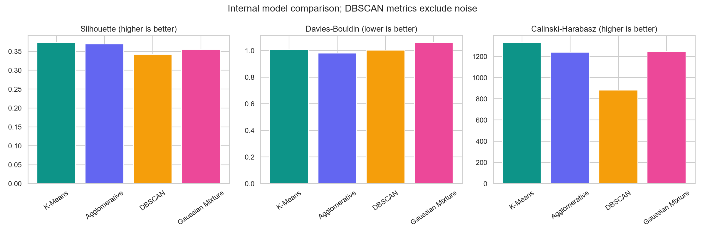
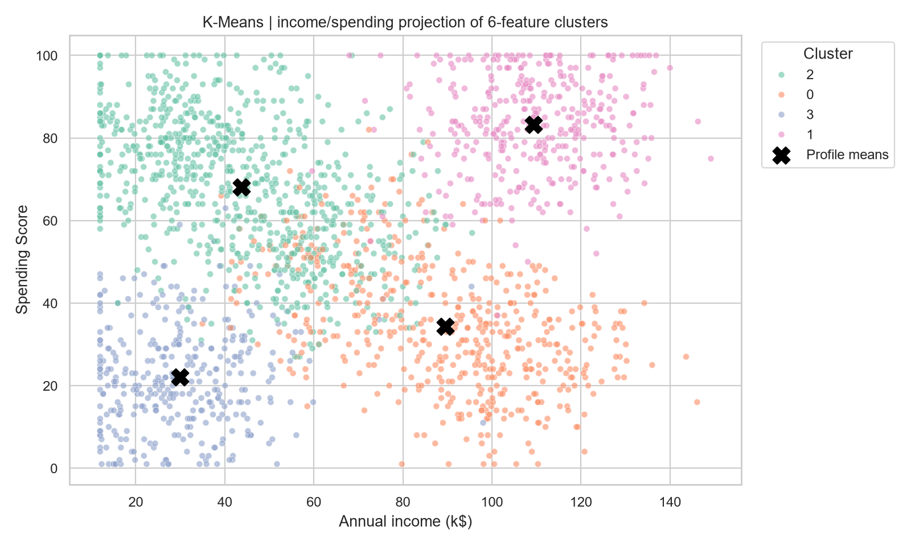
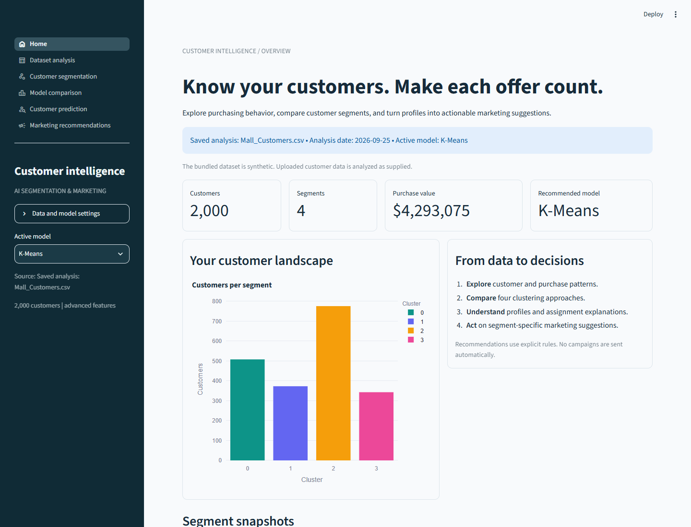
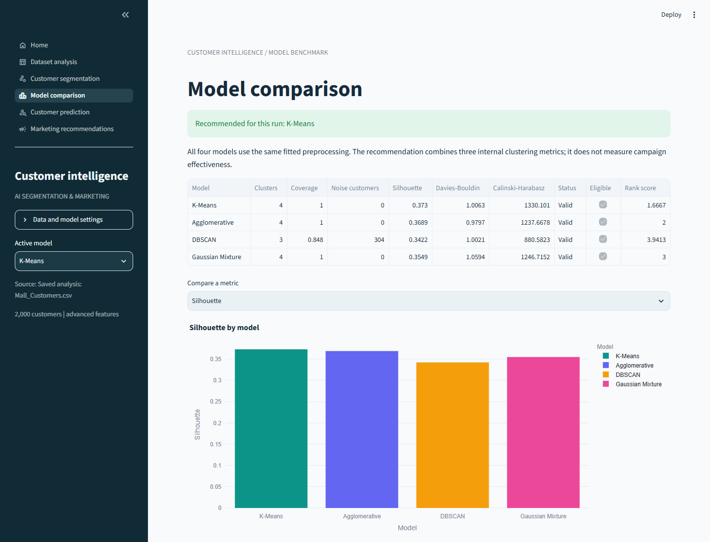
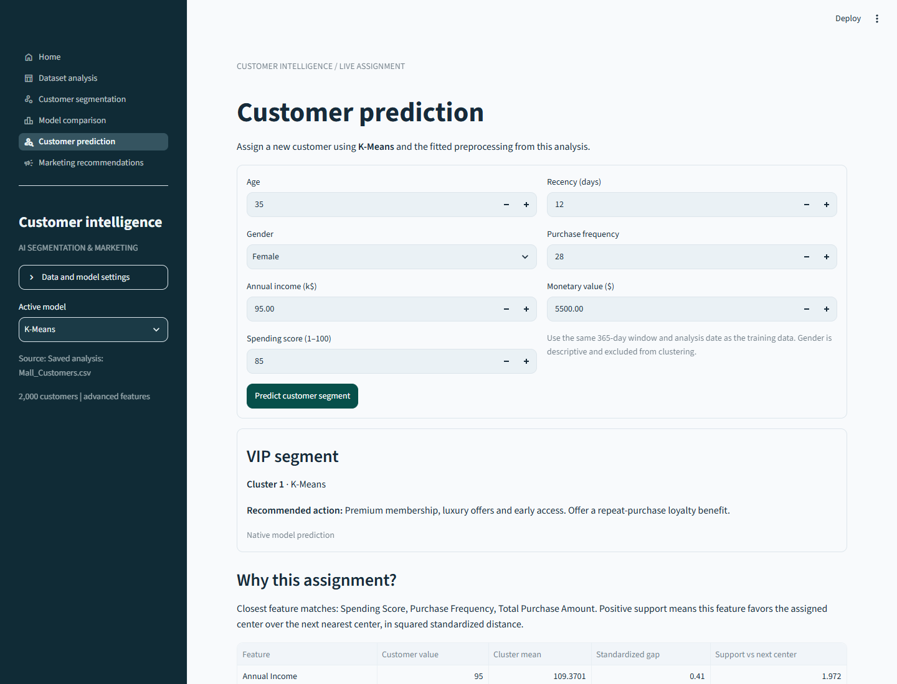

# Technical Reference

This guide preserves the detailed analytics explanation. For the final login, navigation, screenshots and submission files, see the [current README](../README.md).

# AI-Based Customer Segmentation and Personalized Marketing Recommendation System

A complete college ML demonstration: transaction-derived RFM, four clustering algorithms, explainable customer assignment, a six-page Streamlit dashboard, and SQLite persistence.

This upgrades **Mall Customer Segmentation using K-Means Clustering**. The original working project is preserved in `legacy/`; the advanced app also has a classic income/spending feature mode.

## Abstract
This project explores customer behavior by combining recency, purchase frequency, and monetary value with annual income, spending score, and age. It compares K-Means, hierarchical agglomerative clustering, DBSCAN, and Gaussian Mixtures using three internal clustering metrics. Cluster profiles drive transparent marketing rules, while a Streamlit interface supports dataset exploration, model comparison, new-customer assignment, and explanations. SQLite stores customers, transactions, assignments, and recommendations. The bundled dataset is synthetic, so the results demonstrate methods rather than prove real-world business effectiveness.

## Introduction
Income and spending score provide a useful initial view of customers. Purchase history adds context: a previously valuable customer may have stopped buying, while a frequent customer may spend modest amounts per order. RFM summarizes those differences. Combining behavioral and demographic measurements makes it possible to compare multiple views of customer similarity.

Here, **AI-based** means unsupervised machine learning plus a transparent rule-based recommendation layer. There is no LLM, external AI API, paid service, or learned campaign-response model.

## Problem statement
How can a mall group customers using demographic and transaction features, select a useful clustering model, explain new assignments, and propose segment-specific marketing actions in one reproducible application?

## Objectives
- Preserve K-Means, preprocessing, elbow analysis, silhouette evaluation, model persistence, and visualization.
- Compute auditable RFM values from individual purchases.
- Compare four algorithms in one consistently transformed feature space.
- Display model quality and DBSCAN noise coverage honestly.
- Produce interpretable segment profiles and marketing suggestions.
- Support new-customer assignment with algorithm-specific explanations.
- Provide a six-page dashboard with uploads, 2D/3D charts, profile cards, and downloads.
- Persist the workflow in a local SQLite database.

## Literature survey
This is a concise conceptual survey, not a claim to have systematically reviewed all customer-segmentation research.

| Approach | Relevant idea | Application and limitation here |
|---|---|---|
| RFM / customer-base analysis | Recency and frequency summarize purchasing history; monetary value describes observed spending | We compute descriptive RFM. We do not fit a customer-lifetime-value model. Fader, Hardie and Lee (2005) illustrate a separate probabilistic purchase-modeling direction [1]. |
| K-Means | Minimize within-cluster squared distances | Fast baseline with native new-point assignment; sensitive to scaling and compact-cluster assumptions [2]. |
| Ward agglomerative clustering | Repeatedly merge groups to limit variance increases | Alternative hierarchical grouping; no native prediction function for new customers [2]. |
| DBSCAN | Density-connected groups with explicit noise | Can reject unusual observations; depends strongly on radius, density, and scaling [2]. |
| Gaussian Mixture | Represent observations with a mixture of Gaussian components | Allows covariance-aware assignments and component probabilities; local optima and distribution assumptions remain [3]. |
| Internal validation | Measure cohesion/separation without labeled targets | Silhouette, Davies–Bouldin, and Calinski–Harabasz support relative comparisons, not classification accuracy or campaign lift [2,4]. |

## Project structure
```text
AI_Customer_Segmentation/
├── dataset/
│   ├── Mall_Customers.csv
│   ├── Transactions.csv
│   └── provenance.json
├── models/
│   ├── analytics_bundle.pkl
│   ├── k_means.pkl
│   ├── agglomerative.pkl
│   ├── dbscan.pkl
│   └── gaussian_mixture.pkl
├── outputs/
│   ├── screenshots/
│   ├── elbow_curve.png
│   ├── customer_clusters.png
│   ├── customer_eda.png
│   ├── model_comparison.png
│   ├── cluster_distribution.png
│   ├── customer_3d.html
│   ├── model_comparison.csv
│   ├── segmented_customers.csv
│   ├── cluster_centers.csv
│   ├── elbow_scores.csv
│   ├── sample_prediction.json
│   └── metrics.json
├── database/
│   ├── README.md
│   └── customers.db                 # Created locally; excluded from Git
├── src/
│   ├── config.py
│   ├── data_generation.py
│   ├── preprocessing.py
│   ├── clustering.py
│   ├── recommendation.py
│   ├── prediction.py
│   ├── database.py
│   ├── workflow.py
│   ├── visualization.py
│   └── dashboard.py
├── app_pages/                       # Six dashboard pages
├── legacy/                          # Original source, dataset, model and outputs
├── scripts/capture_screenshots.py
├── .streamlit/config.toml
├── .vscode/settings.json
├── app.py
├── main.py
├── test_project.py
├── requirements.txt
├── requirements-lock.txt
├── requirements-dev.txt
├── README.md
└── VIVA_GUIDE.md
```

## Dataset and units
The bundled files contain **2,000 synthetic customers and 32,800 synthetic transactions**, generated with seed 42. The fixed analysis date is **2026-09-25**. The generator samples overlapping behavior patterns with variation in income, age, spending, purchase timing, and basket size. It is plausible demonstration data, not a validated representation of a real population. No true segment labels are used for fitting or evaluation.

| Customer column | Unit / meaning | Model input |
|---|---|---|
| CustomerID | Unique identifier | No |
| Gender | Descriptive category | No |
| Age | Years | Advanced mode |
| Annual Income | Thousands of USD (k$) | Both modes |
| Spending Score | 1–100 indicator | Both modes |
| Purchase Frequency | Transaction count in the analysis window | Advanced mode |
| Total Purchase Amount | USD summed in the analysis window | Advanced mode |
| Last Purchase Date | ISO date of latest in-window purchase | Used to derive recency |
| Recency | Days since last in-window purchase | Advanced mode |
| Customer Satisfaction Score | 1–5 synthetic rating | EDA/export only |

`Transactions.csv` contains `TransactionID`, `CustomerID`, `Purchase Date` (YYYY-MM-DD), and positive `Amount` in USD. One row represents one completed purchase; refunds, returns, and multi-line orders are outside this demo's scope.

The original aliases `Annual Income (k$)` and `Spending Score (1-100)` remain accepted. `Frequency` and `Monetary` are accepted aliases for the corresponding RFM columns.

## Methodology
```text
Customer CSV + optional purchase ledger
             ↓
Schema validation and transaction-derived RFM
             ↓
SQLite customer/transaction snapshot
             ↓
Read customer snapshot → fitted preprocessing
             ↓
K-Means | Agglomerative | DBSCAN | Gaussian Mixture
             ↓
Metrics → recommended model → cluster profiles
             ↓
Marketing rules + prediction explanations
             ↓
SQLite results + saved model bundles + dashboard
```

### RFM calculation
- **Recency:** analysis date minus latest purchase date.
- **Frequency:** count of transactions per customer.
- **Monetary:** sum of transaction amounts per customer.
- Purchases dated from `as_of - 365 days` through `as_of`, inclusive, are considered. Future purchases are rejected; older purchases remain in the ledger but are excluded from RFM.
- A customer with no purchases in the window gets frequency 0, monetary 0, no last-purchase date, and recency 366 as an explicit sentinel.
- Supplied ledgers override precomputed RFM summaries. Without a ledger, advanced mode accepts existing RFM columns and labels them as supplied rather than reconciled.
- The reference date is fixed for reproducibility; it is not silently replaced by today's date.

### Validation and preprocessing
Required identifiers must be present and unique; transaction references must match known customers. The program rejects invalid numbers, infinity, negative measurements, invalid spending/satisfaction ranges, impossible dates, fractional purchase counts, and inconsistent zero-frequency/zero-monetary pairs. Missing gender becomes `Unknown`. An entirely missing model feature is rejected.

For model inputs, a fitted median imputer handles partial missing values. `log1p` reduces RFM skew, then `StandardScaler` scales all selected features. The same fitted transforms are reused for new customers. Customer IDs, gender, and satisfaction are excluded from model distance calculations. Age is included in advanced mode, so analysts should assess whether that choice is appropriate for a real deployment.

Advanced mode uses six features. Classic mode uses income and spending only. The advanced comparison accepts 20–10,000 customer rows to bound interactive costs; Ward clustering and silhouette computations are not intended for unbounded large uploads. The original smaller-data workflow remains available in `legacy/`.

### Algorithms used
1. **K-Means:** K-Means++ initialization, 10 restarts, seed 42. Assign points to nearest centers and update means.
2. **Agglomerative:** Ward linkage and the selected k. Merge groups bottom-up using variance criteria.
3. **DBSCAN:** default `eps=0.75`, `min_samples=10` in transformed coordinates. The number of groups is discovered; `-1` represents noise.
4. **Gaussian Mixture:** selected component count, 3 initializations, regularized covariance, seed 42. Assign to the largest component posterior.

The elbow method evaluates K-Means k=1…10, limited by distinct vectors and dataset size. A normalized-distance knee heuristic suggests k; users can override it. K-Means, Ward and GMM share this k for the configured comparison. DBSCAN settings can be changed independently. The default radius was chosen after exploratory checks on the synthetic demo; this is not held-out parameter optimization.

### Evaluation and automatic recommendation
| Metric | Preferred direction | Interpretation |
|---|---|---|
| Silhouette | Higher | Relative cohesion and separation |
| Davies–Bouldin | Lower | Relative similarity between clusters |
| Calinski–Harabasz | Higher | Between-cluster versus within-cluster dispersion |

Noise is excluded from all three DBSCAN scores, and coverage/noise counts are reported. One cluster, all noise, and one cluster per observation do not receive valid scores. GMM nonconvergence excludes that fit from recommendation.

Silhouette uses all assigned rows up to 2,000 and a seeded sample above that size. Davies–Bouldin and Calinski–Harabasz use all assigned rows. Models must have valid scores and at least 80% coverage to qualify. Eligible models receive ranks for each metric; the average rank plus `(1 - coverage) × eligible_model_count` gives a combined score. Lowest wins, with silhouette then model name as tie-breakers.

“Best” means best under this internal ranking for the current data and settings. These are not held-out accuracy estimates. DBSCAN evaluates a different assigned subset; the coverage policy makes that tradeoff visible but does not eliminate comparability limitations.

## Marketing recommendation engine
`recommendation_engine()` applies readable rules to each cluster's mean profile. “High” income/spending uses the training cohort median, saved with the model.

| Profile | Category | Suggested action |
|---|---|---|
| High income, high spending | VIP segment | Premium membership, luxury offers, early access |
| High income, lower spending | Growth opportunity | Special discounts, personalized product campaigns |
| Lower income, high spending | Value-focused loyalists | Budget-friendly bundles and loyalty rewards |
| Lower income, lower spending | Engagement segment | Engagement campaigns and introductory offers |
| Average recency >90 days | At-risk prefix | Add a win-back message |
| Frequency >= cohort median | Repeat-purchase signal | Add a loyalty benefit |
| DBSCAN noise | Unassigned / unusual behavior | Review before selecting a campaign |

Customer recommendations inherit the assigned segment's profile. They are segment-based personalization, not individual product rankings or proven campaign outcomes. The application does not send messages or launch campaigns.

## New-customer prediction and explainability
The form accepts age, gender, income, spending score, recency, frequency, and monetary value. It returns the model, cluster, category, recommendation, method, and an explanation table. Gender is descriptive; classic mode ignores age/RFM inputs for assignment.

| Model | Assignment for a new customer | Explanation scope |
|---|---|---|
| K-Means | Native nearest-center prediction | Feature-wise squared-distance support versus the next nearest center |
| Agglomerative | Nearest training-centroid proxy | Explains the proxy, not the original hierarchy's merge history |
| DBSCAN | Nearest fitted core sample if within eps; otherwise -1 | Core-sample feature gaps and the radius rule; this is an extension, not native DBSCAN prediction |
| GMM | Native maximum-posterior component | Component probability and descriptive mean similarity; the actual decision also uses covariance and mixture weights |

Explanations show original-unit customer values and cluster means, with gaps/support calculated in standardized log-RFM space. Similarity is not causal attribution. GMM probabilities are not calibrated confidence scores. Inputs outside the training ranges receive warnings; these are simple range checks, not a complete out-of-distribution detector.

## SQLite integration
`database/customers.db` is created automatically. Six tables store immutable snapshots and run history: `datasets`, `customers`, `transactions`, `runs`, `cluster_results`, and `recommendations`. Customer detail/profile JSON preserves optional columns within the relational dataset/run structure. Foreign keys and parameterized inserts are enabled.

CLI training writes a dataset snapshot, reads it back for modeling, then stores results. Dashboard **Run analysis** does the same. Changing the active model or making a prediction does not create a new training run. One-off prediction inputs are not added to the customer database. The default dashboard opens a saved analysis for fast startup.

The database is local and excluded from Git because uploads may contain user data. Included CSVs and saved demo artifacts contain only synthetic records.

## Results
Measured on the bundled data using advanced mode, seed 42, k=4 (elbow suggestion), DBSCAN eps=0.75 and min_samples=10:

| Model | Clusters | Coverage | Silhouette ↑ | Davies–Bouldin ↓ | Calinski–Harabasz ↑ |
|---|---:|---:|---:|---:|---:|
| K-Means | 4 | 100% | 0.3730 | 1.0063 | 1330.10 |
| Agglomerative | 4 | 100% | 0.3689 | 0.9797 | 1237.67 |
| DBSCAN | 3 | 84.8% | 0.3422 | 1.0021 | 880.58 |
| Gaussian Mixture | 4 | 100% | 0.3549 | 1.0594 | 1246.72 |

**Recommended model: K-Means.** DBSCAN flags 304 customers as noise. Ward has the best Davies–Bouldin score, illustrating why no single metric tells the full story.

| K-Means segment | Customers | Mean income (k$) | Mean spending score | Mean recency | Category |
|---|---:|---:|---:|---:|---|
| 0 | 508 | 89.49 | 34.34 | 80.79 days | Growth opportunity |
| 1 | 373 | 109.37 | 83.22 | 11.77 days | VIP segment |
| 2 | 776 | 43.79 | 68.07 | 28.83 days | Value-focused loyalists |
| 3 | 343 | 29.98 | 22.02 | 145.71 days | At-risk / Engagement segment |

Cluster IDs are arbitrary. Changing data, mode, settings, or library versions may change labels and metrics. Correlated frequency/monetary/spending features may give purchasing behavior extra influence despite standardization. There is no claimed accuracy percentage, proven revenue uplift, or ground-truth segmentation.




## Screenshots
Actual screenshots of the running application are saved in `outputs/screenshots/`.





The folder also contains dataset, segmentation, and marketing pages. Optional screenshot reproduction uses `requirements-dev.txt` and Microsoft Edge: `python scripts/capture_screenshots.py`. That script starts and stops its own temporary server and verifies a synthetic CSV upload.

## Installation and VS Code startup
Use Python 3.11 or newer. The verified local environment uses Python 3.14.6. Open `D:\ML project\AI_Customer_Segmentation` in VS Code and use **Python: Select Interpreter** to choose `.venv\Scripts\python.exe`.

The existing local environment is already installed:
```powershell
cd "D:\ML project\AI_Customer_Segmentation"
.\.venv\Scripts\python.exe main.py
.\.venv\Scripts\python.exe -m streamlit run app.py
```
Open **http://localhost:8501**. Keep the terminal open; press **Ctrl+C** to stop. No virtual-environment activation is required with these commands.

For a fresh copy:
```powershell
python -m venv .venv
.\.venv\Scripts\python.exe -m pip install -r requirements.txt
.\.venv\Scripts\python.exe main.py
.\.venv\Scripts\python.exe -m streamlit run app.py
```
On macOS/Linux use `python3 -m venv .venv` and `.venv/bin/python` instead. `requirements-lock.txt` records the verified runtime versions; use it for matching environments. Playwright is optional and is not needed to run the app.

### CLI examples
```powershell
.\.venv\Scripts\python.exe main.py --clusters 5
.\.venv\Scripts\python.exe main.py --eps 0.85 --min-samples 10
.\.venv\Scripts\python.exe main.py --data dataset/My_Customers.csv --transactions dataset/My_Transactions.csv --as-of 2026-09-25
.\.venv\Scripts\python.exe main.py --mode classic --data legacy/dataset/Mall_Customers.csv
.\.venv\Scripts\python.exe main.py --help
```
`--generate` explicitly replaces the bundled synthetic CSVs. Normal CLI runs replace current model/output artifacts and append a new SQLite run. Use `--output`, `--model-dir`, and `--database` to isolate experiments. The bundled ledger is only selected automatically with the bundled customer file, never with an unrelated custom CSV.

### Dashboard pages
1. **Home:** customer counts, purchase value, recommended model, segment snapshots.
2. **Dataset analysis:** missing values, distributions, correlation chart, RFM and downloads.
3. **Customer segmentation:** 2D/3D views, elbow chart, distribution, profiles and assignments.
4. **Model comparison:** metric table, interactive comparison chart and selection policy.
5. **Customer prediction:** seven inputs, segment/category/recommendation and explanation.
6. **Marketing recommendations:** segment cards, customer profiles, downloadable audiences.

Open **Data and model settings** in the sidebar to upload data, choose classic/advanced mode, set the analysis date, override k, and adjust DBSCAN. Submit **Run analysis** once; navigating pages reuses that result. The active-model selector explores each fitted algorithm without retraining. Uploaded datasets stay in the current session and local SQLite; they do not overwrite bundled CSV/model files.

### Original project
Run `python legacy/main.py` or `python -m streamlit run legacy/app.py`. Its original 500-customer data, outputs, documentation and saved model remain intact. The upgraded two-feature mode is also available through `--mode classic`.

## Saved model usage
```python
from src.config import BUNDLE
from src.workflow import load_bundle
from src.prediction import predict_customer

bundle = load_bundle(BUNDLE)
result = predict_customer(bundle, {
    "Age": 35, "Gender": "Female", "Annual Income": 95,
    "Spending Score": 85, "Recency": 12,
    "Purchase Frequency": 28, "Total Purchase Amount": 5500,
}, model_name="K-Means")
print(result["category"], result["recommendation"])
print(result["explanation"])
```
The model bundle persists preprocessing, estimators, labels, profiles, rules/thresholds, and analysis metadata. Import `src` from the project root. Pickle artifacts must be trusted and loaded with compatible library versions; uploaded pickle files are never accepted.

## Verification
```powershell
.\.venv\Scripts\python.exe -m unittest -v test_project.py
```
Eleven tests cover RFM reconciliation, zero-purchase customers, validation, imputation, serialized prediction consistency, native prediction labels, DBSCAN outliers, hierarchical proxy disclosure, invalid metric partitions, coverage-aware ranking, SQLite integrity, classic-mode compatibility, six-page navigation and all four prediction methods. Browser verification additionally exercises rendering and CSV upload.

## Future scope
- Validate segments with representative, consented real data.
- Evaluate stability across seeds, samples and time periods.
- Tune algorithm settings with a documented search policy.
- Study feature weighting and redundant transaction features.
- Add product/category affinity and individual ranking models.
- Evaluate campaign effects with randomized experiments rather than cluster metrics.
- Explore probabilistic purchase/CLV models, such as BG/NBD, separately from clustering.
- Add access control, retention controls, dataset versioning and monitored deployment.
- Add refund handling, multi-line order aggregation, seasonality and drift detection.

## References
1. Fader, Hardie and Lee (2005), [“Counting Your Customers” the Easy Way: An Alternative to the Pareto/NBD Model](https://www.brucehardie.com/papers/018/).
2. scikit-learn, [Clustering user guide](https://scikit-learn.org/stable/modules/clustering.html).
3. scikit-learn, [Gaussian mixture models](https://scikit-learn.org/stable/modules/mixture.html).
4. scikit-learn, [Silhouette score](https://scikit-learn.org/stable/modules/generated/sklearn.metrics.silhouette_score.html).
5. Streamlit, [Application testing](https://docs.streamlit.io/develop/api-reference/app-testing/st.testing.v1.apptest).

See [VIVA_GUIDE.md](../VIVA_GUIDE.md) for the presentation script and questions with answers.
